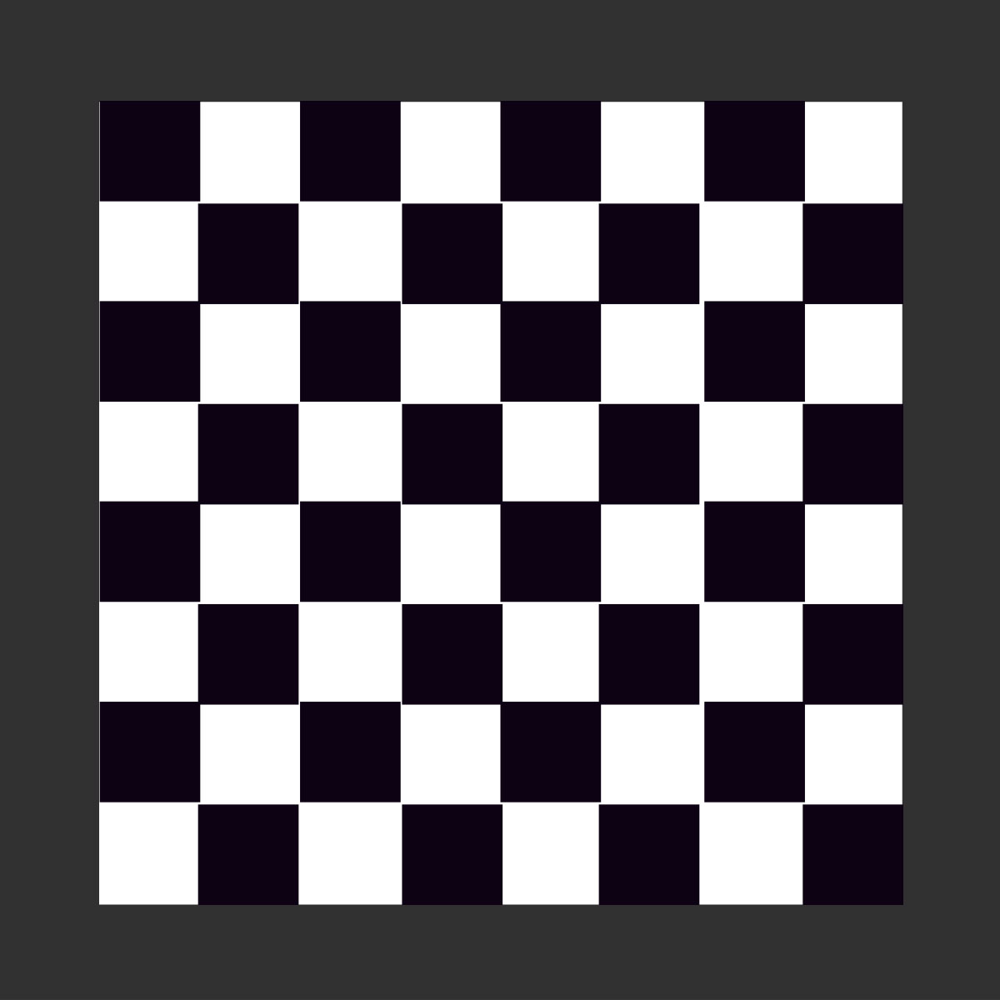

## Exo 1 : 19/07

### 1.
A partir d’un âge, on doit indiquer l’année de naissance

### 2.
A partir de ce tableau [ 12, 15, 19, 2], calculer la moyenne des valeurs.

### 3.
A partir d’un prix HT unitaire d’un produit, ainsi que le nombre de produit. On veut connaitre le total TTC arrondi à 2 chiffres après la virgule.

### 4.
A partir de la température d’un volume d’eau, on veut savoir dans quel état est l’eau (solide, liquide ou gaz) (positif : liquide, négatif : solide, au dela de 70° [indicatif] : gaz)

### 5.
On souhaite stocker les notes d'étudiants, vous utiliserez un tableau associatif pour ça

Données :

Albert : 12, 8, 9, 7, 13
Michel : 14, 13, 12, 11, 10
Vincent : 17, 16, 15, 18, 13
Faite une fonction qui prend en paramètre un tableau de note et permet de calculer la moyenne de l'étudiant

### 6.
Faire une fonction qui prend 2 arguments en paramètres : un prix et un pourcentage.

La fonction doit renvoyer le prix augmenté avec le pourcentage

### 7.

Écrivez une fonction pour supprimer les doublons d’un tableau : Exemple : [1, 2, 2, 3, 3, 3, 4, 5, 5] Résultat attendu : [1, 2, 3, 4, 5]

### 8.

Avec le moins de lignes de code possible, proposez moi un algorithme qui, pour un nombre donné, affiche la table de multiplication liée. Par exemple : Si je demande 1, je veux voir :

1x1 = 1
1x2 = 2
etc Et ce jusqu'à 12

### 9.

Faites une fonction qui prend en argument une chaîne de caractères (LONGUE) Cette fonction doit afficher les 15 premiers caractères puis '...' Par exemple :

Je passe la chaîne : 'Lorem quisque class vestibulum'
La fonction doit afficher 'Lorem quisque c...'

### 10.

Faites une fonction checkPassword, dont le but est de vérifier la validité d'un mot de passe, qui sera pris en argument Un mot de passe est considéré valide lorsqu'il fait plus de 9 caractères, et qu'il contient au moins le caratère '@' La fonction renverra un booléen pour indiquer la validité du mot de passe

### 11.

Faire une fonction qui prend en paramètre une durée, en miilisecondes

Et l'afficher sous forme de chaîne de caratères

Exemple :

Param : 225000

Affichage : 03:45"00

### 12.

Faire une fonction qui ajoute derrière chaque voyelle d'une chaine de caractères 'fe' et répète ensuite la voyelle

Par exemple :

Chat donne : chafeat

## Programmation Objet (utilisation de classes)
### 13.

Créer une interface Boisson, elle est caractérisée par :
- name
- alcohol : oui ou non
- price

Créer une classe Bar, elle est caractérisée par un tableau de boisson, qui représente la carte du bar
Un bar a aussi un nom

Faites une fonction, dans la classe Bar, qui permet d'afficher la "carte" du bar en console.log

### 14.

Nous allons faire un jeu de Yatzee : https://fr.wikipedia.org/wiki/Yahtzee

Comment feriez-vous pour le modéliser avec en objet ?
Réfléchissez à ça, et appelez-moi lorsque vous avez une idée, que je vous la valide (ou pas !)

Une fois la "solution" trouvée :
- Faire une fonction qui effectue un lancé (l'affiche via un console.log)
- Faire une fonction qui informe du résultat effectué par l'utilisateur
  (PS : pour le moment ne pensez pas aux suites !!!!)

### 15.

Une fois les résultats "standard" donnés, faite le pour les suites.

### 16.

Et maintenant... En prévision de la suite, comment feriez-vous pour faire un échiquier ?

Pareil, réfléchissez à comment le faire en objet.

Je veux juste l'échiquier pour l'instant : 

